<!-- @format -->

# AWS-Powered Data Visualization: Analyzing Netflix Movie Metadata

## 📄 Project Objective

The objective of this project is to create an interactive & insightful data visualization dashboard using AWS services, particularly Amazon QuickSight. The project focuses on visualizing Netflix movie metadata and user ratings to derive insights and analyze patterns in the dataset. The main goal is to explore trends, such as the relationship between budget and revenue, the average rating per genre & other key insights.

## 🔧 Services Used

| Service        | Purpose                                                         |
| -------------- | --------------------------------------------------------------- |
| Amazon S3      | Cloud storage for dataset (CSV file) and manifest file          |
| AWS QuickSight | Data visualization and business intelligence (BI) service       |
| AWS IAM        | Manage access and permissions for QuickSight and S3 integration |

## Focus and Technologies

This project focuses on using cloud services for data storage, visualization, and analysis. Key technologies include:

- **Amazon S3**: For scalable data storage and retrieval
- **Amazon QuickSight**: For creating interactive dashboards and visualizations
- **IAM (Identity Access Management)**: To manage security and access control for AWS resources

## 📋 Detailed Step-by-Step Setup

### ✅ Step 1: Dataset Selection and Preparation

- **Dataset Source**: The Netflix dataset was downloaded from Kaggle, containing movie metadata and user ratings. [Click Here](https://www.kaggle.com/datasets/shivamb/netflix-shows) for Download
- **Data Format**: The dataset is saved as a **`CSV`** file for ease of use and compatibility with AWS services.
- **Data Processing**: The dataset is pre-processed to remove any inconsistencies or missing values. The cleaned dataset is then uploaded to Amazon S3 for further use.

### ✅ Step 2: Create an S3 Bucket

1. Open the AWS Management Console.
2. Navigate to the S3 service.
3. Click on "**Create Bucket**" enter a unique name for the bucket & choose the region.
<div align="center">
        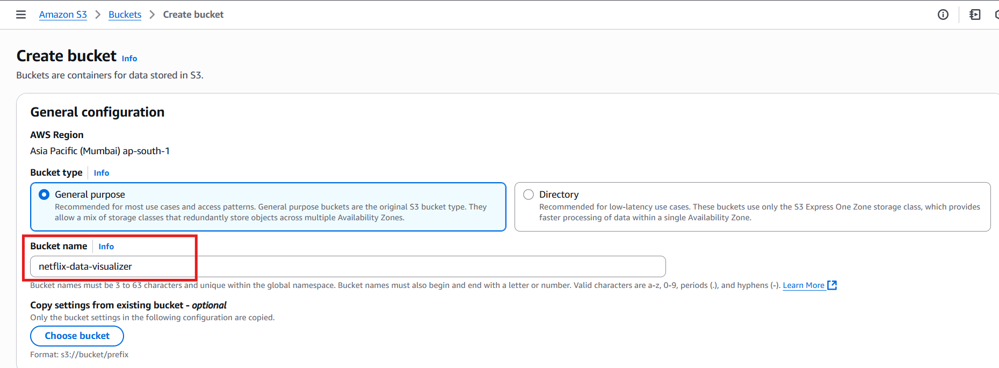
</div>

4. Enable Block All Public Access to keep the bucket private.
<div align="center">
        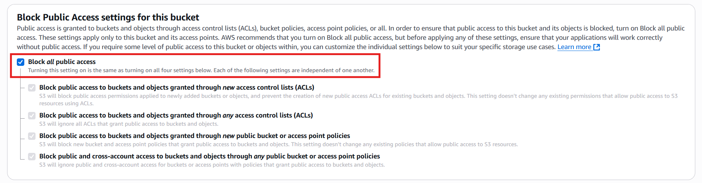
</div>

5. Click Create.

### ✅ Step 3: Upload the CSV File to S3

1. Open the S3 bucket you just created.
2. Click Upload, select the CSV file containing the Netflix dataset & upload it to the bucket.
3. Once the upload is complete, copy the S3 URL for the CSV file. You’ll use this URL in the **`manifest.json`** file in the next step.
<div align="center">
        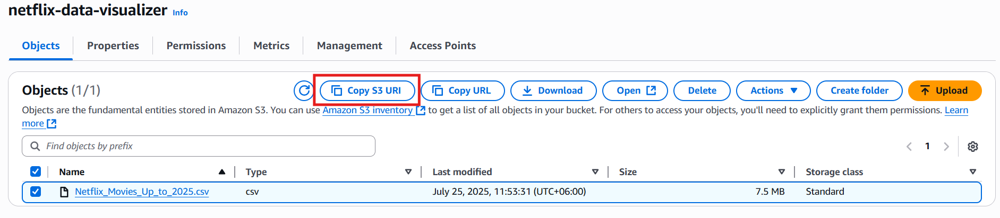
</div>

### ✅ Step 4: Create the `manifest.json` File

After uploading the CSV file, create the `manifest.json` file. This file will instruct QuickSight on how to access and interpret the CSV file stored in S3. The **`manifest.json`** file should have the following structure:

```json
{
  "fileLocations": [
    {
      "URIs": ["s3://your-bucket-name/your-dataset.csv"]
    }
  ],
  "globalUploadSettings": {
    "format": "CSV",
    "delimiter": ",",
    "textqualifier": "\"",
    "containsHeader": "true"
  }
}
```

Replace the placeholder **`"s3://your-bucket-name/your-dataset.csv"`** with the actual S3 URL you copied in the previous step.

<div align="center">
        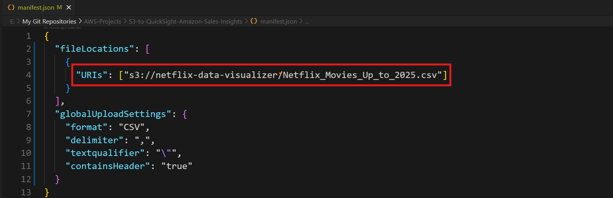
</div>
Save the manifest.json file on your local machine.

### ✅ Step 5: Upload the Manifest File to S3

1. Go back to the S3 bucket where you uploaded the CSV file.
2. Click Upload, select the **`manifest.json`** file & upload it to the same S3 bucket.

### ✅ Step 6: Create a QuickSight Account

1. Open AWS QuickSight in the AWS Management Console.
2. If you are already signed in to AWS, click on Sign In to the Console. If not, click Create a Free Account to create a new AWS account.
<div align="center">
        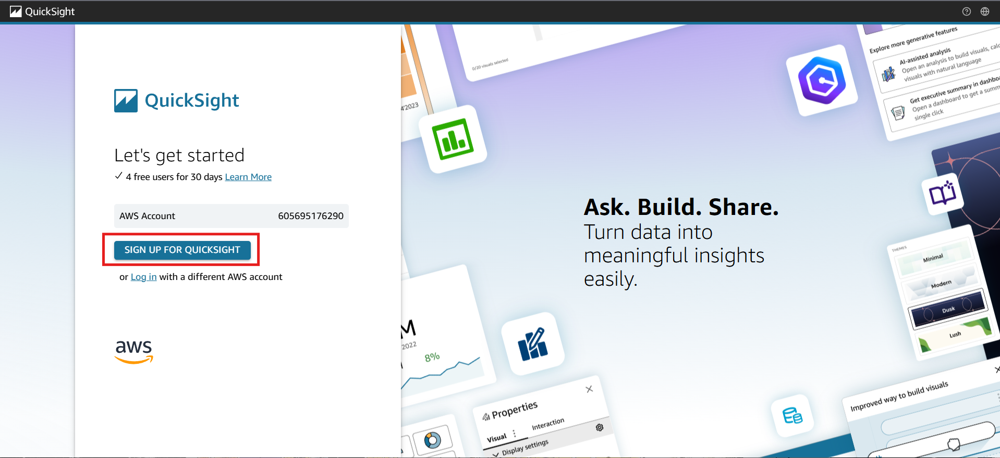
</div>

3. Finalize the setup by entering the account name & email.
4. Select the region where you want your QuickSight resources to reside (ensure this is the same region as your S3 bucket).

<div align="center">
        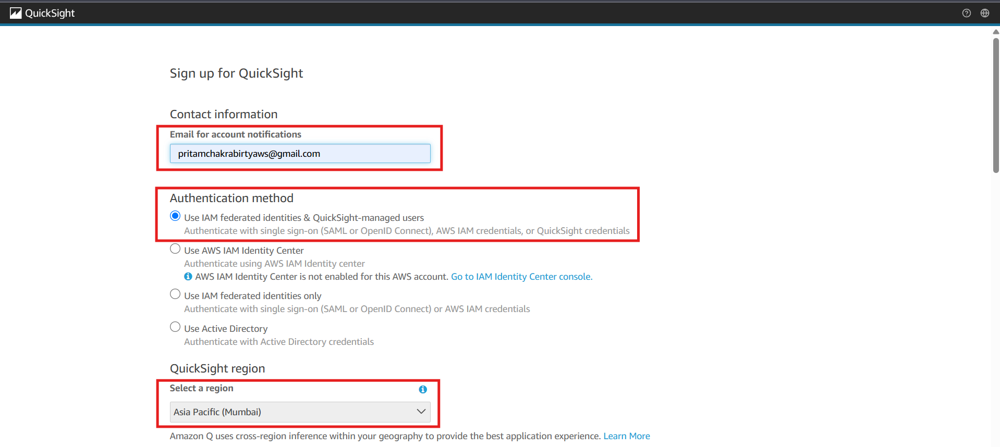
</div>

<div align="center">
        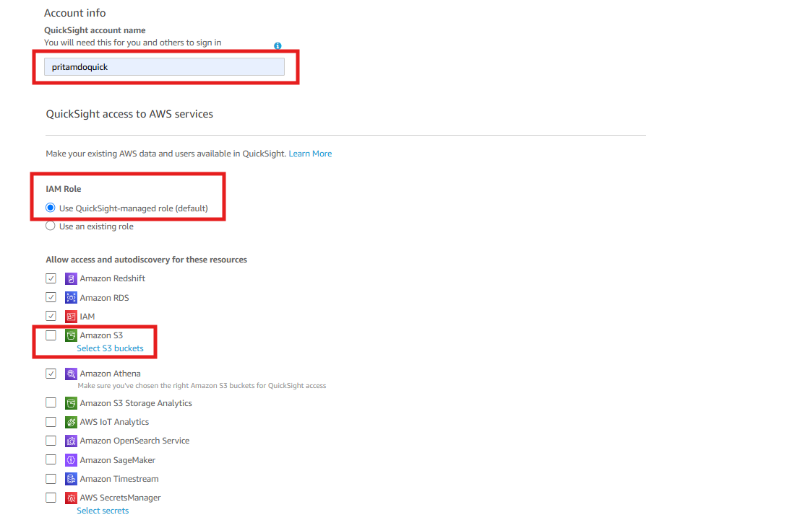
</div>

<div align="center">
        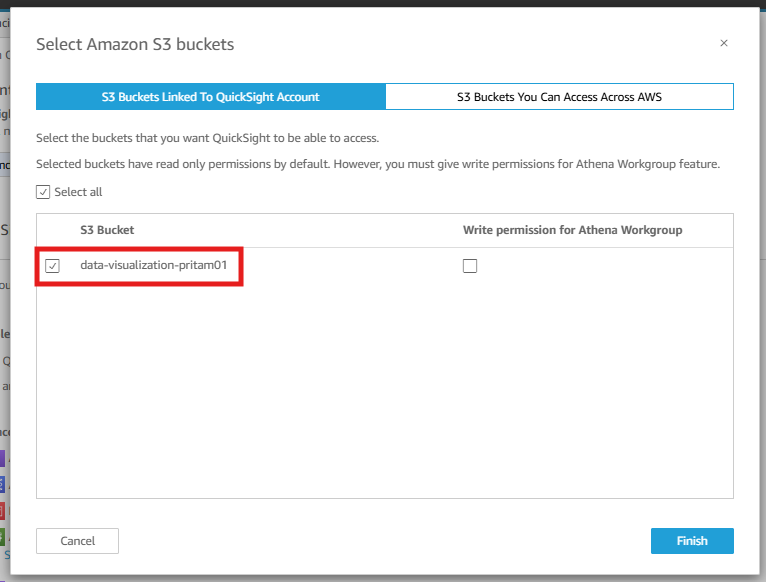
</div>

<div align="center">
        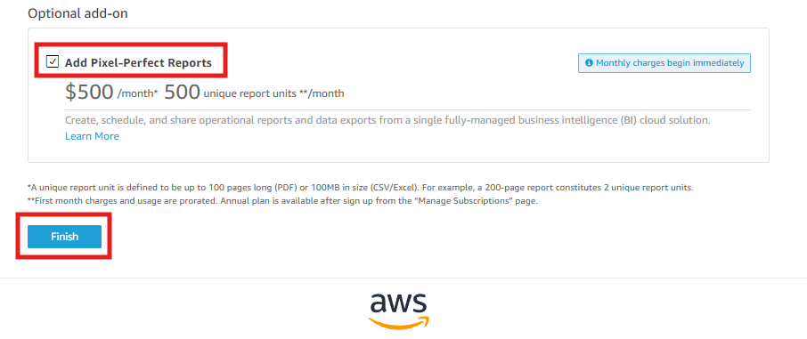
</div>

<div align="center">
        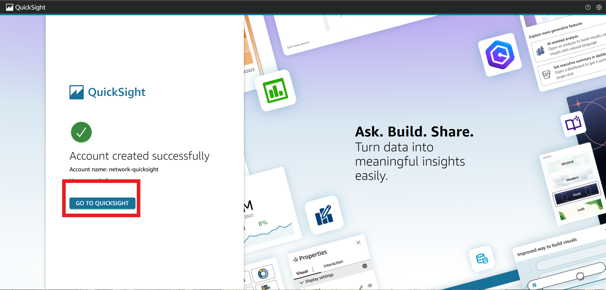
</div>

### ✅ Step 7: Connect QuickSight to S3

1. In the QuickSight dashboard, select Datasets > New Dataset.

<div align="center">
        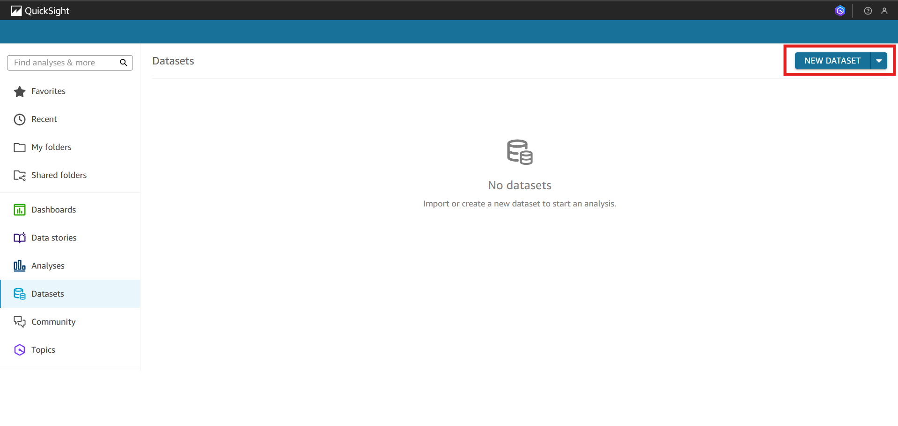
</div>

2. Choose S3 as the data source.

<div align="center">
        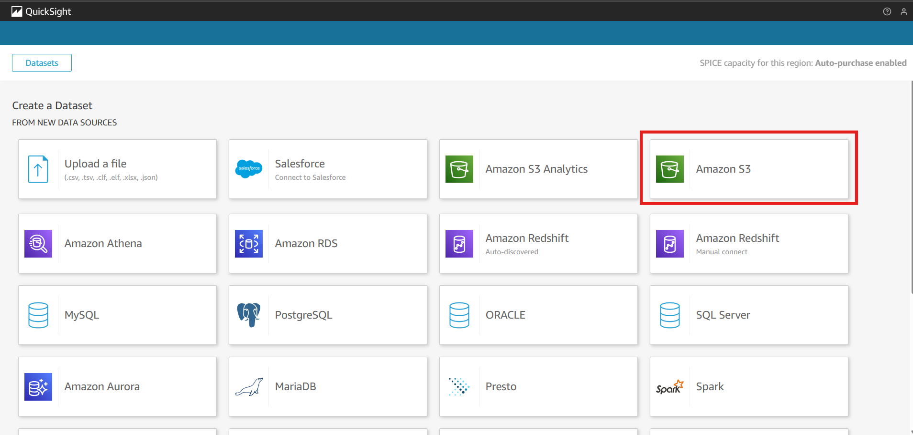
</div>

3. In the S3 data source setup, paste the S3 URL of the manifest.json file you uploaded earlier.

<div align="center">
        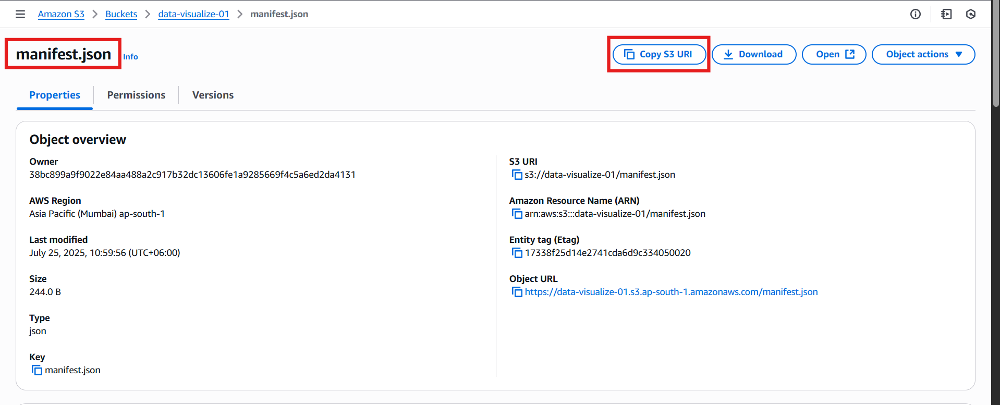
</div>

<div align="center">
        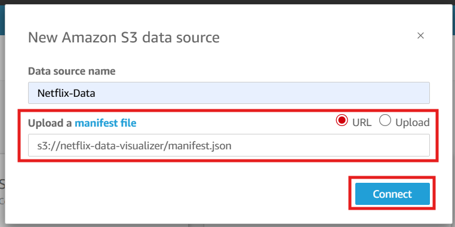
</div>

### ✅ Step 8: Connect QuickSight to S3 Create Visualizations in QuickSight

1. After successfully connecting QuickSight to the dataset, you can start creating visualizations.

<div align="center">
        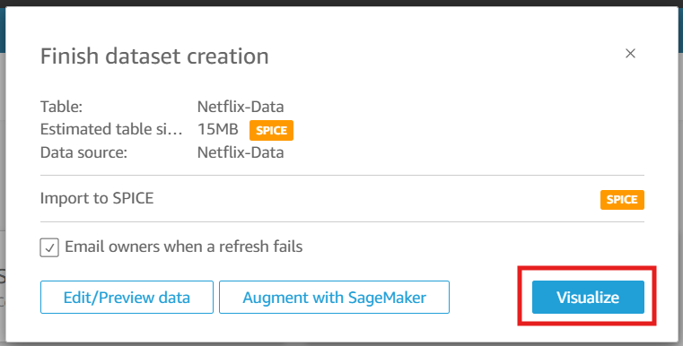
</div>

1. QuickSight offers a variety of visualization types such as bar charts, line charts, pie charts & more.

<div align="center">
        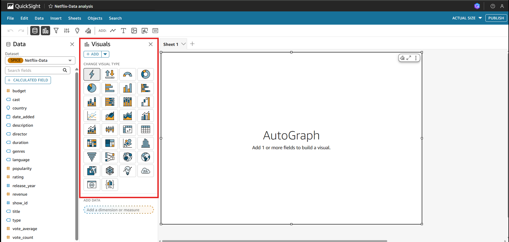
</div>

### ✅ Step 9: Create visualizations to analyze patterns in the Netflix dataset

### 1. Average rating per genre

<div align="center">
        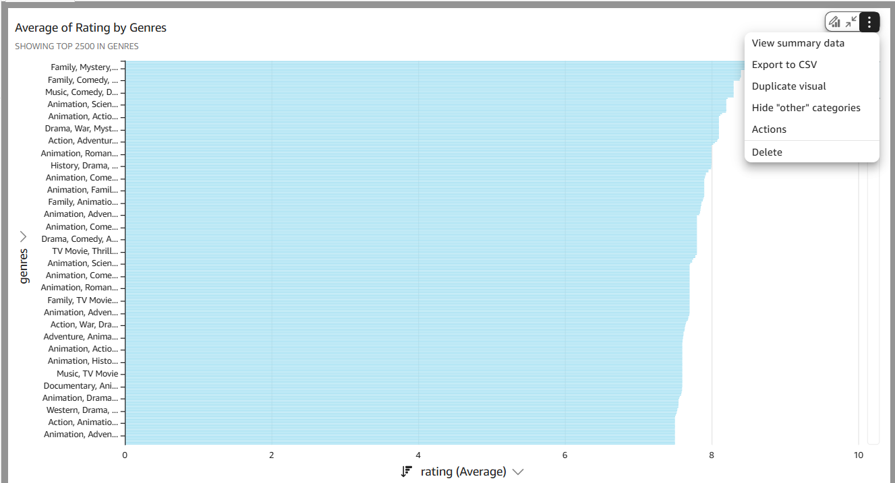
</div>

### 2. Count of Records by Country and Genres

<div align="center">
        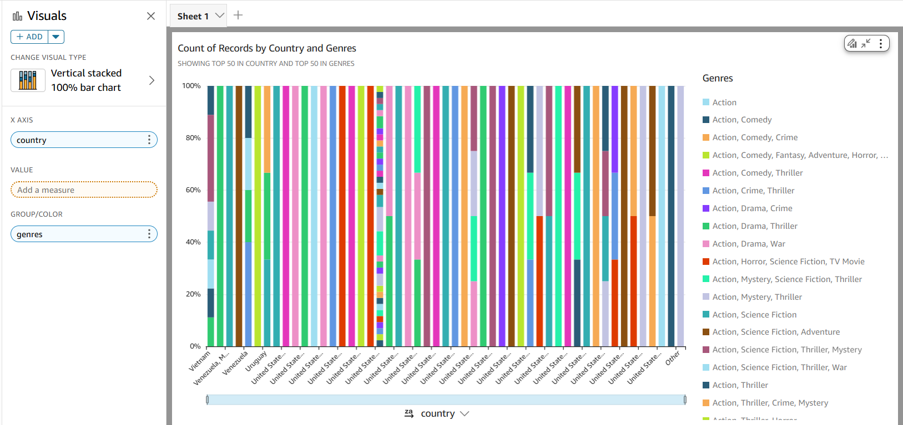
</div>

### 3. Sum of Popularity by Country and Release_year

<div align="center">
        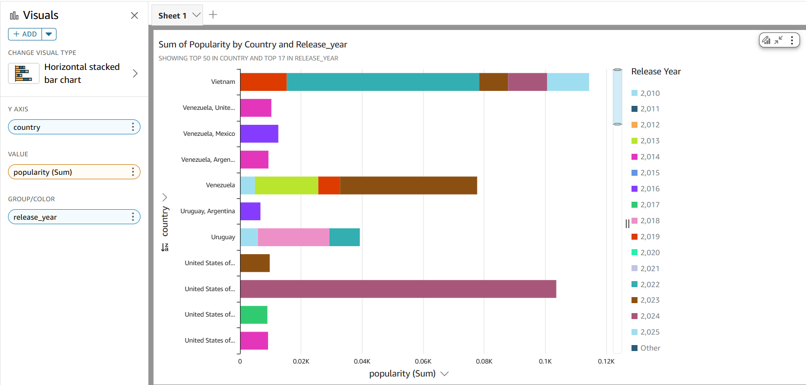
</div>

### 3. Sum of Rating by Budget and Release_year

<div align="center">
        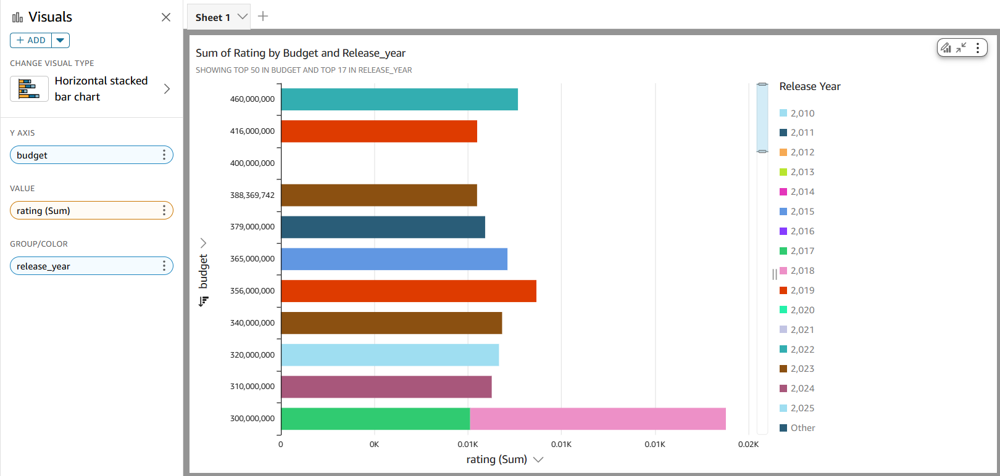
</div>

### 4. Sum of Budget by Country

<div align="center">
        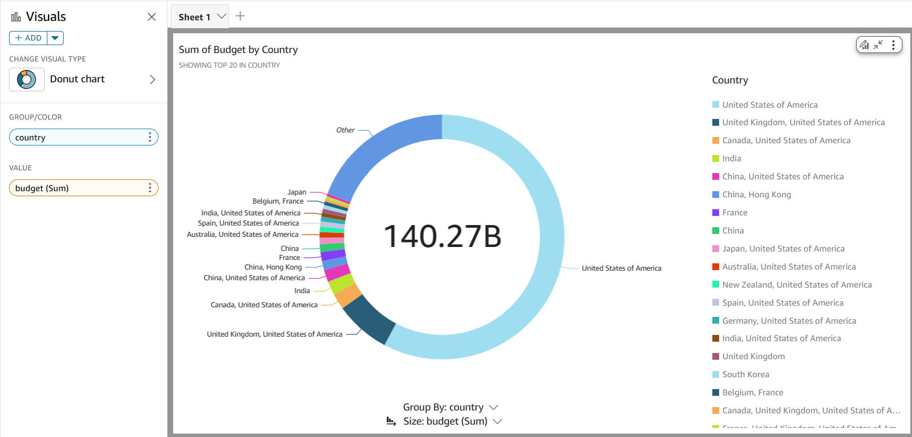
</div>

## QuickSight Dataset Refresh Policy

Refreshing the dataset ensures that any new data added to the source or changes made to the existing data, are reflected in the visualizations and analyses. This is important for keeping the insights up to date especially when your data source (like S3) is regularly updated or modified.

1. Go to Datasets in the QuickSight dashboard.
2. Select your dataset from the list.

<div align="center">
        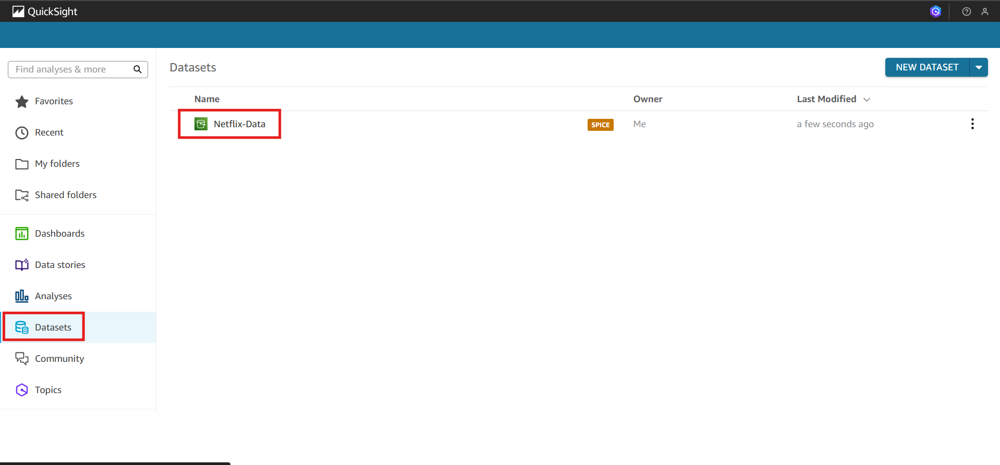
</div>

3. Click on the **Refresh** tab.

<div align="center">
        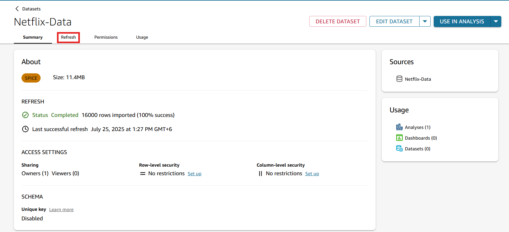
</div>

4. Click on **Refresh Now** to update the dataset immediately.

<div align="center">
        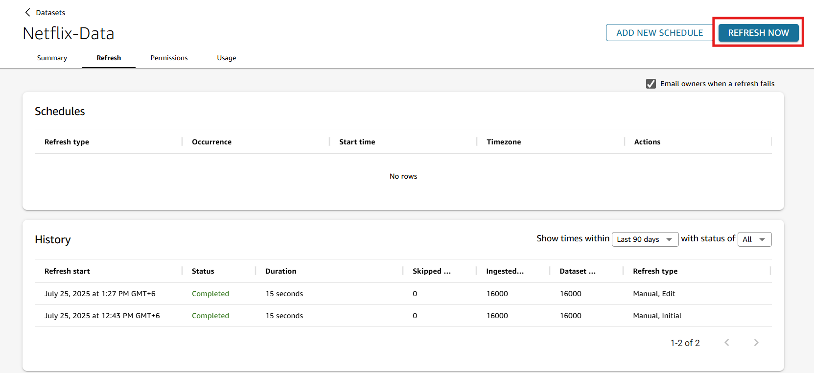
</div>

## Troubleshooting

### 1 S3 Permissions Issues

- **Problem:** QuickSight cannot access the S3 dataset.
- **Solution:** Ensure the correct IAM role is assigned to QuickSight with read access to the S3 bucket & check the S3 bucket policy.

### 2 Incorrect Manifest File Format

- **Problem:** QuickSight fails to load the dataset.
- **Solution:** Verify the manifest file structure and correct S3 path for the CSV.

### 3 Slow Dataset Loading

- **Problem:** QuickSight takes too long to load the dataset.
- **Solution:** Optimize the dataset size and structure for quicker loading.

### 4 Data Inconsistencies

- **Problem:** Missing or incorrect data.
- **Solution:** Clean the dataset before uploading and handle missing values.

## 🚮 Cleanup Process

1. To avoid unnecessary charges, it’s important to clean up resources once the project is complete:
2. Delete the S3 Bucket
3. Remove QuickSight Resources
4. IAM Role Cleanup
5. Ensure there are no active services that will incur additional costs.
