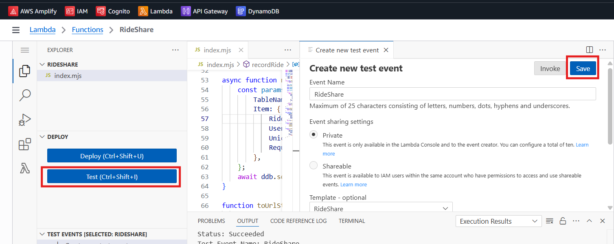

<!-- @format -->

# RideVibe: AWS-Powered Ride Sharing Platform Documentation

## 📄 Project Objective

The **Ride Sharing App** is a serverless web application designed to enable seamless ride-sharing services. It allows users to register, authenticate, and create ride requests through a secure, scalable, and efficient platform. By leveraging AWS services, the application ensures robust user management, data storage, and API-driven functionality, catering to both riders and drivers.

## 🔧 Technology and Tools

The project utilizes the following AWS services and tools:

- **AWS Amplify**: Facilitates front-end hosting and continuous integration/continuous deployment (CI/CD) with GitHub.
- **Amazon Cognito**: Manages user authentication and authorization.
- **Amazon API Gateway**: Provides secure REST APIs for handling ride-related operations.
- **AWS Lambda**: Executes serverless backend logic for processing ride requests.
- **Amazon DynamoDB**: Serves as a NoSQL database for storing ride and user data.
- **AWS IAM**: Manages roles and permissions for secure resource access.
- **GitHub**: Hosts the source code and enables version control.

## Project Focus

The project emphasizes the following key areas:

- Secure user authentication and role-based access using Amazon Cognito.
- Serverless backend processing with AWS Lambda and API Gateway for efficient ride request handling.
- Reliable and scalable data storage using Amazon DynamoDB.
- Automated deployment through AWS Amplify integrated with GitHub.
- Robust security through IAM roles and API Gateway authorization.

## 📄 Detailed Step-by-Step Guide

### ✅ Step 1: Source Code Setup

1. Create a GitHub repository for the **Ride Sharing App**.
2. Upload the source code files, including front-end code, `config.js`, and Lambda function code, to the repository.

### ✅ Step 2: AWS Amplify Setup

1. Navigate to the AWS Amplify Console and select **Deploy an App**.

        

2. Authorize Amplify to access your GitHub account:
   - A pop-up will prompt you to authorize Amplify.
   - Select **Selected Repository** or **All Repositories**, then click **Install and Authorize**.
      

           
      

3. In the **Add Repository and Branch** section, select your **Ride Sharing App** repository and the appropriate branch (e.g., `main`) & Click **Next**.
   

     
   

4. In the **App Settings** section, retain the default settings and click **Next**.
5. Review the configuration and click **Save and Deploy**.
   

      
   

6. Wait for the deployment to complete. Once the status displays **Deployed**, click the provided domain link to access the hosted application.
   

      
   

### ✅ Step 3: Amazon Cognito Setup

1. Navigate to the Amazon Cognito Console and select **Create User Pool**.
   

      
   

2. In **Define Your Application**, choose **Single Page Application (SPA)** to avoid generating a client secret & give a Name to your application.
   

      
   

3. In the **Configure** options:
   - Select **Username** as the sign-in method.
   - For required attributes during sign-up, select **Email**.
      

         
      

4. Click **Create User Pool** to provision the user pool.
5. From the created user pool, copy the **User Pool ID**.
6. In your source code, locate the **`config.js`** file and paste the **User Pool ID** under the **`userPoolId`** field.
7. Navigate to **App Clients** in the Cognito Console, copy the **Client ID** & paste it into **`config.js`** under the **`userPoolClientId`** field.
8. **Update the AWS region** in **`config.js`** to match your **user pool’s region** (e.g., `us-east-1`).
9. Commit and push the updated `config.js` to your GitHub repository.
10. Wait for Amplify to redeploy the application. Access the domain link, register a user via email, and enter the verification code sent to your email to complete registration.
11. Sign in to the application and copy the **authentication token** displayed on the screen.
      

         
      

### ✅ Step 4: Amazon DynamoDB Setup

1. Navigate to the Amazon DynamoDB Console & click **Create Table**.
2. Enter a table name (e.g., **`Rides`**) & specify a **Partition Key** (e.g., **`RideId`**).
   

      
   

3. Keep all other settings as default and click **Create Table**.
4. Copy the **Resource ARN** of the created table for use in IAM configuration.

### ✅ Step 5: AWS IAM Setup

1. Navigate to the AWS IAM Console and select **Create Role**.
   

      
   

2. In **Trusted Entity Type**, select **AWS Service**.
3. Choose **Lambda** as the use case and click **Next**.
   

      
   

4. Under **Add Permissions**, select the **AWSLambdaExecutionRole** policy and click **Next**.
   

      
   

5. Provide a role name (e.g., **`RideSharingLambdaRole`**) & click **Create Role**.
   

      
   

6. Select the created role, navigate to **Permission Policies** & click **Add Permissions** > **Create Inline Policy**.
   

      
   

7. In the policy editor:
   - Select **DynamoDB** as the service.
   - For **Actions Allowed**, select **PutItem**.
   - In the **Resources** section, choose **Specific** and click **Add ARN**.
      

         
      

   - Paste the DynamoDB table’s **Resource ARN** in the pop-up (Text) and click **Add ARN**.
      

         
      

8. Click **Next**, provide a policy name (e.g., `DynamoDBWriteAccess`) & click **Create Policy**.
   

      
   

### ✅ Step 6: AWS Lambda Setup

1. Navigate to the AWS Lambda Console and click **Create Function**.
2. Select **Author from Scratch**.
   

      
   

3. Provide a function name (e.g., **`CreateRideFunction`**).
4. Select **Node.js 22.x** as the runtime.
   

      
   

5. Choose **Use an Existing Role** and select the IAM role created earlier (e.g., **`Ride-Share`**).
   

      
   

6. Click **Create Function**.
7. In the Lambda function editor copy the Lambda function code from your GitHub repository’s README file.
8. Update the code to reference your DynamoDB table name (e.g., **`Ride-Sharing`**).
   

      
   

9. Deploy the function by clicking **Deploy**.
   

      
   

10. Create a test event:
    - Click **Create New Test Event** provide a test event name & paste the test event JSON from your repository’s README.
      

         
      

    - Save the test event and click **Test**.
      

         
      

    - Verify the output shows **Status: Succeeded** and **Status Code: 201**.
      

         
      

11. Navigate to the DynamoDB Console, select your table (e.g., `Ride-Sharing`), and click **Explore Table Items** to confirm the new entry.

   

   

### ✅ Step 7: Amazon API Gateway Setup

1. Navigate to the Amazon API Gateway Console and select **Create REST API**.
   

      
   

2. Provide an API name (e.g., `RideSharingAPI`) and click **Create**.
3. In the **Authorizers** section, click **Create Authorizer**:
   - Provide an authorizer name (e.g., `CognitoAuthorizer`).
   - Select **Cognito** as the type and choose your created user pool.
   - Set the **Token Source** to `Authorization`.
   - Click **Create Authorizer**.
      

         
      

4. Select the created authorizer, scroll to **Test Authorizer**, paste the authentication token copied earlier, and click **Test**. Verify a **200 response**.

   

5. In the **Resources** section, click **Create Resource**:
   - Provide a resource name (e.g., **`Ride`**) & enable **CORS**.
   - Click **Create Resource**.
      

         
      

6. Select the created resource and click **Create Method**:
   

         
   

   - Choose **POST** as the method type.
   - Set **Integration Type** to **Lambda**.
   - Enable **Lambda Proxy Integration**.
   - Select your Lambda function (e.g., `CreateRideFunction`) and click **Create Method**.
      

         
      

7. In the **Method Request** settings for the POST method, click **Edit**:
    

             
    

   - In the **Authorization** section, select the created authorizer (e.g., `RideShare`).
     

      
     

   - Click **Save**.

8. Deploy the API:
   - Click **Deploy API**, select **New Stage** and name it (e.g., **`dev`**).
      

         
      

   - Copy the **Invoke URL** generated after deployment.
      

         
      

9. Update your source code’s **`config.js`** file:

- Paste the **Invoke URL** into the **`invokeUrl`** field.
   

         
   

- Commit and push the updated file to your GitHub repository.

### ✅ Step 8: Final Deployment and Testing

1. Wait for Amplify to complete the redeployment of the application.
2. Access the Amplify domain link and append **`/ride.html`** to the URL (e.g., **`https://<amplify-domain>/ride.html`**).
3. Verify that the Ride Sharing App is fully functional and accessible.
   

         
   

## 🔥 Project Outcome

The **Ride Sharing App** is successfully deployed as a serverless web application with the following capabilities:

- **User Authentication**: Users can securely sign up and sign in using Amazon Cognito, with email-based registration and verification.
- **Ride Creation**: Users can create ride requests through a REST API with data persistently stored in DynamoDB.
- **Scalable Backend**: AWS Lambda and API Gateway provide a serverless, scalable infrastructure for processing ride requests.
- **Hosted Front-End**: The application is hosted via AWS Amplify, with automated deployments triggered by GitHub commits.
- **Secure Access**: IAM roles and Cognito based authorization ensure secure access to AWS resources and APIs.

## Troubleshooting

- **Amplify Deployment Fails**:
  - Ensure the GitHub repository is correctly connected and the specified branch exists.
  - Review the Amplify Console logs for detailed error messages.
- **Cognito Authentication Issues**:
  - Verify that the `userPoolId` and `userPoolClientId` in `config.js` match the Cognito User Pool settings.
  - Confirm the AWS region in `config.js` is correct (e.g., `us-east-1`).
- **Lambda Function Errors**:
  - Ensure the DynamoDB table name in the Lambda function code matches the created table.
  - Verify that the IAM role includes the `PutItem` permission for DynamoDB.
- **API Gateway 403/401 Errors**:
  - Confirm that the Cognito authorizer is properly configured and the authentication token is valid.
  - Ensure the API is deployed to the correct stage (e.g., `dev`).
- **DynamoDB Entry Not Visible**:
  - Verify that the Lambda function is correctly writing to the specified table.
  - Check the table name and partition key in the Lambda code.

## 🚮 Cleaning Steps

To decommission resources and avoid ongoing AWS charges:

1. **AWS Amplify**:
   - Navigate to the Amplify Console, select the app, and click **Delete App**.
2. **Amazon Cognito**:
   - Go to the Cognito Console, select the user pool, and click **Delete User Pool**.
3. **Amazon DynamoDB**:
   - Navigate to the DynamoDB Console, select the table (e.g., `Rides`), and click **Delete Table**.
4. **AWS Lambda**:
   - Go to the Lambda Console, select the function (e.g., `CreateRideFunction`), and click **Delete**.
5. **Amazon API Gateway**:
   - Navigate to the API Gateway Console, select the API, and click **Delete API**.
6. **AWS IAM**:
   - Go to the IAM Console, select the role (e.g., `RideSharingLambdaRole`), and click **Delete**.
   - Delete any associated inline policies.
7. **GitHub Repository**:
   - If no longer needed, delete or archive the repository from GitHub.
