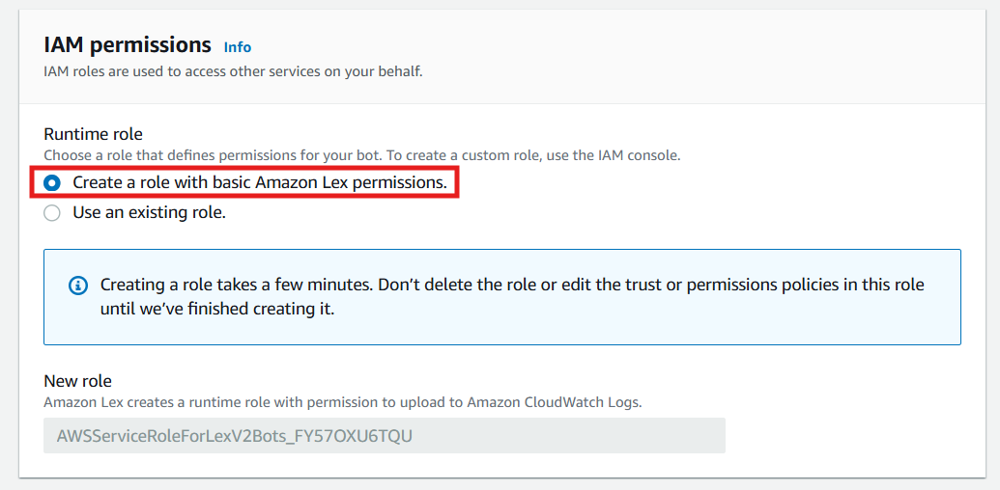
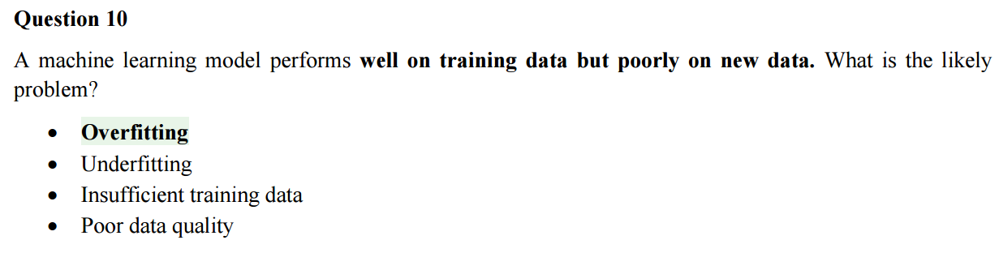

<!-- @format -->

# SmartQuery: AI-Powered Knowledge Engine with AWS & Lex Chatbot

## 📄 Project Objective

The objective is to create a robust, AI-driven chatbot that efficiently answers user questions by extracting relevant information from unstructured PDF documents stored in Amazon S3. By integrating Amazon Lex with a Bedrock knowledge base using Retrieval-Augmented Generation (RAG), the project aims to provide accurate, contextually relevant responses, showcasing proficiency in AWS technologies and advanced AI techniques for real-world applications.

---

## 🔧 Services Used

1. **Amazon Lex V2**: Powers the chatbot’s conversational interface, handling user intents & utterances for seamless interaction.
2. **Amazon Bedrock**: Provides the knowledge base and generative AI model (Anthropic Claude V2) for RAG-based query processing.
3. **Amazon S3**: Stores PDF documents that form the chatbot’s knowledge base.
4. **Amazon OpenSearch Serverless**: Serves as the vector store for efficient semantic search in the knowledge base.
5. **AWS IAM**: Manages permissions for secure access to AWS services.

---

## 📄 Detailed Step-by-Step Guide

### ✅ Step 1: Enable Amazon Bedrock Model Access

Configure access to Amazon Bedrock models required for the chatbot’s natural language processing and RAG functionality.

1. Sign in to the AWS Management Console and navigate to Amazon Bedrock.
2. In the Bedrock dashboard, locate the **Model Access** section under "**Configure and Learn**."
   

            
      

3. Enable the following models:

   - **Anthropic Claude 3 Haiku** (cost-effective for conversational tasks).

      

               
      

   - **Amazon Titan Embeddings G1 – Text V1.2** (for RAG embeddings).

      

               
      

4. If models are not available, select **Request Model Access**, choose the models & submit. Approval may take a few minutes.

  

           
  

5. Verify that the models are active in the **Model Access** section before proceeding.

### Purpose

This step allows the chatbot to access Amazon Bedrock’s powerful AI models, essential for **processing** & **responding** to **user inputs**. The **Anthropic Claude 3 Haiku** model **enables human-like conversations** while **keeping costs low**. The **Amazon Titan Embeddings G1 – Text V1.2** model **generates high-quality text embeddings for RAG**, enabling the **chatbot to retrieve relevant information from the S3 knowledge base** and combine it with generated responses for accurate, context-aware answers.

### Notes

- Ensure your AWS account has sufficient permissions for Bedrock access.
- **Check model availability in your AWS region**.

---

### ✅ Step 2: Create an Amazon S3 Bucket

Set up an Amazon S3 bucket to store documents for the chatbot’s RAG knowledge base.

1. Sign in to the AWS Management Console and navigate to Amazon S3.
2. Click **Create Bucket** & enter a globally unique name (e.g., **`pritam-chatbot-01`**).

  

           
  

3. Choose the same AWS region as your Amazon Bedrock setup to reduce latency.
4. Enable **Block All Public Access** to keep the bucket private and secure.

  

           
  

5. Complete bucket creation with default settings unless specific needs apply.
6. Upload sample documents (e.g., PDFs, text files, or Word documents) to the bucket for use in RAG-based responses.

### Purpose

This step creates a secure **Amazon S3 bucket to store the chatbot’s knowledge base for RAG**, using documents like FAQs and manuals. Blocking public access ensures data security and privacy, vital for system reliability and compliance.

### Notes

- Ensure the bucket name is unique and follows AWS naming rules (e.g., lowercase, numbers, hyphens).
- Confirm uploaded documents are in formats supported by Bedrock (e.g., PDF, TXT, CSV).
- Set up IAM roles later to allow Bedrock access to the S3 bucket.

---

### ✅ Step 3: Create a Knowledge Base in Amazon Bedrock

**Set up a knowledge base in Amazon Bedrock** to **integrate with the S3 bucket**, **enabling the chatbot to retrieve information from uploaded documents for RAG**.

1. Sign in to the AWS Management Console and navigate to Amazon Bedrock.
2. From the left sidebar, select **Knowledge Bases** & click **Create Knowledge Base**.

   

            
   

   

            
   

3. Choose **Knowledge Base with Vector Store** to **support unstructured text** (e.g., PDFs) & **semantic search**, aligning with the RAG workflow. **Avoid the structured data store**, as it requires manual preprocessing **unsuitable for PDFs**.

  

           
  

4. Enter a name for the knowledge base, e.g., **`AI-Practitioner-Question-Answer`**.
5. Keep the default IAM permissions and select **Create and use a new service role**.

  

           
  

6. Set the **Data Source Type** to **Amazon S3**, as the **PDFs are stored in an S3 bucket** & click **Next**.

  

           
  

7. Under **Data Source Location**, select **This AWS Account**, click **Browse S3** & choose the S3 bucket created in Step 2.

  

           
  

  

            
  

8. Keep default settings for other options and click **Next**.
9. Select **Amazon Titan Embeddings G1 – Text V1.2** as the embedding model for text-to-text processing.

  

           
  

  

            
  

10. Choose **Quick create a new vector store (recommended)** with **Amazon OpenSearch Serverless** as the vector store type, then click **Next**.

  

            
  

11. Review all settings and click **Create Knowledge Base**. Wait several minutes for creation to complete.

  

            
  

12. Once created, scroll to the **Data Source** section, select the **data source** & click **Sync**.

  

            
  

13. Wait until the status shows **Available** again indicating the knowledge base is ready.

### Purpose

This step creates a knowledge base in Amazon Bedrock, **enabling the chatbot to retrieve relevant information** from documents in the S3 bucket for the RAG process. The vector store and Amazon Titan Embeddings G1 – Text V1.2 enable efficient semantic search over unstructured PDFs, allowing the chatbot to quickly access and use accurate content in its responses.

### Notes

- Ensure the **S3 bucket and Bedrock are in the same AWS region** to avoid latency issues.
- Verify that the IAM role has permissions to access the S3 bucket and Bedrock services.
- The sync process may take time depending on the size and number of documents.

---

### ✅ Step 4: Set Up an Amazon Lex Bot

Create and configure an Amazon Lex V2 bot to handle user interactions, define intents & set up conversational responses for the chatbot.

1. Navigate to **Amazon Lex V2** > **Bots** > **Create Bot**.

  

            
  

2. Select **Traditional** & choose **Create a Blank Bot**.

  

            
  

3. Enter a bot name, e.g., **`AI-Practitioner-Question-Answering-Bot`**.

  

            
  

4. Create a new IAM role with basic Amazon Lex permissions or select an existing role with appropriate permissions.

  

            
  

5. Under **Children’s Online Privacy Protection Act (COPPA)**, select the appropriate compliance option based on your requirements and click **Next**.
6. Choose your **preferred language for the bot** & **add an optional description**. Select a voice for interaction (e.g., a default AWS voice) and click **Done**.

  

            
  

7. Create an intent with a name, e.g., **`User-Welcome-Intent`**.

  

            
  

8. Scroll to **Sample Utterances** and add example phrases users might say, e.g., **“Hello”**, **“Hi”**, or **“Start chat”**.

  

            
  

9.  In the **Initial Response** section, define the bot’s response to the intent, e.g., **“Hello! How can I help you?”**.

  

            
  

10. Click **Advanced Options**, then in the **Set Values dropdown**, under **Next Step in Conversation**, select **Wait for User Input** & click **Update Options**.

  

            
  

  

            
  

  

            
  

  

            
  

11. From the left sidebar, click **Back to Intents**. The dashboard will display two intents: the newly created **User-Welcome-Intent** & a **Default Intent**.

  

            
  

12. Click **Build** to compile the bot configuration and intents. Wait for the **“Successful”** message to appear.

  

            
  

  

            
  

13. Click **Test** to open the test interface. Type one of the sample utterances to verify the bot responds with the initial response.

  

            
  

14. Use the **Inspect** option to confirm the correct intent is triggered.

  

            
  

### Purpose

This step **sets up an Amazon Lex V2 bot** as the **chatbot’s conversational interface**, allowing it to understand user inputs and respond appropriately. By defining intents and sample utterances, the bot can recognize user queries, like greetings or questions & provide predefined responses. This setup forms the base for user interaction, which will later integrate with the Bedrock knowledge base for RAG-based responses.

### Notes

- Ensure the IAM role has permissions for Amazon Lex and any future integrations (e.g., Bedrock or Lambda).
- Test multiple utterances to verify intent recognition accuracy.
- The bot’s language and voice settings should align with your target audience.

---

### ✅ Step 5: Configure QnA Intent for Amazon Lex Bot

**Add** & configure a **built-in QnA intent** in Amazon Lex to enable the chatbot to answer user queries by leveraging the Bedrock knowledge base and a generative AI model.

1. In the Amazon Lex V2 console, navigate to the bot created in Step 4 and click **Add Intent > Use Built-in Intent**.
2. Select the **AMAZON.QnAIntent - GenAI Feature** & name the intent, e.g., **`QNA-Bot-Intent`**. Click **Add**.

  

            
  

3. Scroll to the **QnA Configuration** section and select the generative AI model, e.g., **Anthropic Claude V2**.

  

            
  

4. Navigate to the **Knowledge Bases** section in Amazon Bedrock, locate the knowledge base created in **Step 3**, copy the **Data Source ID** & paste it into the **Knowledge Base for Amazon Bedrock ID** field in Lex.

  

            
  

5. Keep all other settings as default, then click **Save Intent**.
6. Click **Build** to update the bot configuration. Wait for the **“Successful”** message to appear.

7. Click **Test** to open the test interface. Enter queries related to the content in the PDFs uploaded to the S3 bucket (Step 2) to verify if the bot provides accurate responses.

### Purpose

This step integrates the Amazon Lex bot with the Bedrock knowledge base using the QnA intent, allowing the chatbot to answer user questions by retrieving relevant information from stored documents. The **AMAZON.QnAIntent** uses the RAG workflow, where the selected model (e.g., Claude V2) generates responses based on the retrieved data, improving the chatbot's ability to deliver accurate, context-aware answers.

### Notes

- Ensure the selected model (e.g., Claude V2) is enabled in Amazon Bedrock (Step 1).
- Test a variety of queries to confirm the bot retrieves and responds correctly based on the knowledge base content.
- The **Data Source ID** must match the knowledge base created in Step 3 to ensure proper integration.

### ✅ Step 6: Validate Chatbot Query Results and Visualize Outcome

Test the Amazon Lex bot to confirm it answers PDF-based queries accurately using the Bedrock knowledge base and visualize the query response flow with a diagram.

1. In the Amazon Lex V2 console, go to the bot from Steps 4 and 5, and click **Test**.
2. Enter queries from the PDFs in the S3 bucket (Step 2) to test the **QNA-Bot-Intent** (Step 5).
3. Confirm the bot retrieves accurate responses from the Bedrock knowledge base (Step 3).

  

            
  

  

            
  

  

            
  

  

            
  

  

            
  

  

            
  

4. If responses are **inaccurate** check the **knowledge base sync** (Step 3) or **Data Source ID** (Step 5).

### Notes

- Test a variety of questions to cover different sections of the PDFs for robust validation.
- Ensure the knowledge base is fully synced (Step 3) to reflect the latest PDF content.
- If integrating with external platforms, verify IAM permissions for deployment.

---

## 🔥Project Outcome

The AI-Powered Knowledge Query Engine successfully delivers a chatbot that accurately responds to user queries by retrieving and generating answers from PDFs stored in S3. The integration of **Amazon Lex, Bedrock** & **S3** enables a seamless RAG workflow, validated through testing with diverse queries. The chatbot is ready for deployment to platforms like **websites** or **messaging services**, demonstrating a scalable, **AI-driven solution** with **potential for enterprise use**.

---

## 🚮 Cleaning Steps

- In the **Amazon Lex V2** console, navigate to the bot select your created one & click **Delete**.
- In the **Amazon Bedrock** console, go to **Knowledge Bases**, select the knowledge base & **Delete** it.
- In the **Amazon S3** console, navigate to the bucket delete all uploaded files, and then **Delete the Bucket**.
- In the **Amazon OpenSearch Serverless** console, locate the vector store created in Step 3 & delete it.
- In the **AWS IAM** console, identify and delete any roles created for the project (e.g., Lex or Bedrock service roles), ensuring no dependencies remain.
- Verify in the **AWS Billing Dashboard** that no resources related to the project are incurring costs.
