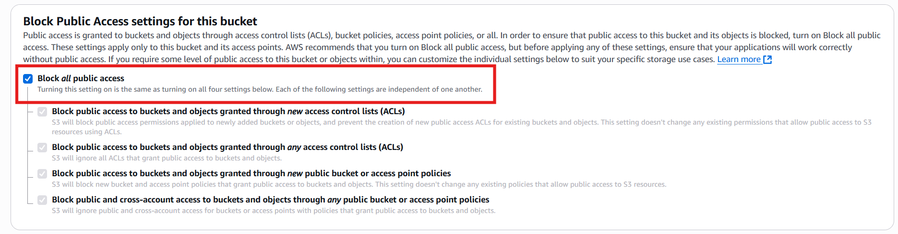
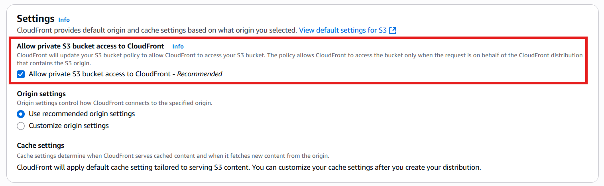
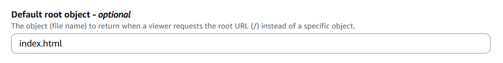

<!-- @format -->

# Smart Static Website Hosting on AWS

**Technologies**: S3 (Private), CloudFront (OAI), AWS WAF, CloudWatch Logs, SNS Notifications.

**Focus:** Secure, Monitored, Scalable, Serverless Hosting within AWS

## 📄 Project Objective

The goal of this project is to securely host a static website on AWS without making the S3 bucket public. The architecture leverages CloudFront OAI (Origin Access Identity) to securely serve the content, WAF to protect against common web attacks, CloudWatch Logs for monitoring & SNS Notifications for alerting on potential threats — all carefully designed to remain within AWS Free Tier usage limits.

## 🔧 **AWS Services Used**

<div align="center">

| **Service**                      | **Purpose**                                       |
| -------------------------------- | ------------------------------------------------- |
| **Amazon S3**                    | Host static website files (Private Bucket)        |
| **CloudFront**                   | CDN with HTTPS and OAI for private S3 access      |
| **OAI (Origin Access Identity)** | Restrict direct S3 access, grants only CloudFront |
| **AWS WAF**                      | Web security: blocks malicious traffic            |
| **CloudWatch Logs**              | Logs WAF traffic                                  |
| **CloudWatch Alarms**            | Trigger alerts for security events                |
| **SNS**                          | Email alerts for suspicious traffic               |

---

</div>

## 📋 Detailed Step-by-Step Setup

### ✅ Step 1: Create a Private S3 Bucket

- **Actions:**

  - Create an S3 bucket.
  - Enable **Block All Public Access** to keep the bucket private.

    <div align="center">
        
    </div>

  - Upload your static website files (e.g., `index.html`, `error.html`).
  - **Do NOT** create a public bucket policy.
  - Confirm direct access via the S3 URL results in **Access Denied**.

- **Troubleshooting:**
  - **Problem:** Confused due to absence of bucket policy.
  - **Solution:** CloudFront with OAI handles the permissions, no public access is required for the S3 bucket.

---

### ✅ **Step 2: Create CloudFront Distribution with OAI**

- **Actions:**

  - Set **Origin Domain** as: **`bucket-name.s3.<region>.amazonaws.com`**.
  - Allow private S3 bucket access to CloudFront.

    <div align="center">
        
    </div>

  - Set **Viewer Protocol Policy** to **Redirect HTTP to HTTPS**.
  - Set **Default Root Object** to `index.html`.

    <div align="center">
        
    </div>

  - Deploy the Distribution & wait until deployment is complete.

- **Access the site via :**

  ```url
  https://<distribution-id>.cloudfront.net/index.html
  ```

- **Troubleshooting:**
  - **Problem:** Seeing **“Access Denied”** error when accessing the CloudFront URL.
  - **Solution:**
    1. **Confirm OAI permissions:** Ensure that the Origin Access Identity (OAI) is properly configured & associated with your CloudFront distribution. AWS automatically applies the necessary permissions to allow CloudFront access to the S3 bucket.
    2. **Ensure you are not accessing the S3 website endpoint:** Make sure you are using the CloudFront distribution URL not the S3 website URL as the latter does not have the proper permissions set for CloudFront.
    3. **Don't forget to set **`index.html`** as the default root object:** If you miss setting **`index.html`** as the root object in CloudFront you will encounter an Access Denied error because CloudFront won't know which file to load by default.
