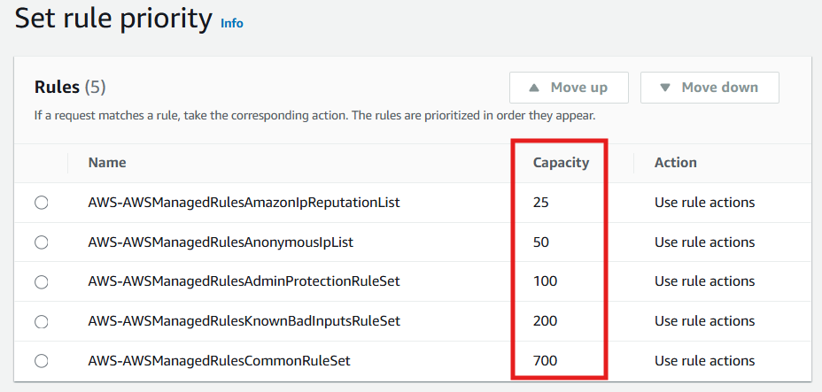

<!-- @format -->

# Smart Static Website Hosting on AWS

**Technologies**: S3 (Private), CloudFront (OAI), AWS WAF, CloudWatch Logs, SNS Notifications.

**Focus:** Secure, Monitored, Scalable, Serverless Hosting within AWS

## 📄 Project Objective

The goal of this project is to securely host a static website on AWS without making the S3 bucket public. The architecture leverages CloudFront OAI (Origin Access Identity) to securely serve the content, WAF to protect against common web attacks, CloudWatch Logs for monitoring & SNS Notifications for alerting on potential threats — all carefully designed to remain within AWS Free Tier usage limits.

## 🔧 **AWS Services Used**

<div align="center">

| **Service**                      | **Purpose**                                       |
| -------------------------------- | ------------------------------------------------- |
| **Amazon S3**                    | Host static website files (Private Bucket)        |
| **CloudFront**                   | CDN with HTTPS and OAI for private S3 access      |
| **OAI (Origin Access Identity)** | Restrict direct S3 access, grants only CloudFront |
| **AWS WAF**                      | Web security: blocks malicious traffic            |
| **CloudWatch Logs**              | Logs WAF traffic                                  |
| **CloudWatch Alarms**            | Trigger alerts for security events                |
| **SNS**                          | Email alerts for suspicious traffic               |

---

</div>

## 📋 Detailed Step-by-Step Setup

### ✅ Step 1: Create a Private S3 Bucket

- **Actions:**

  - Create an S3 bucket.
  - Enable **Block All Public Access** to keep the bucket private.

    <div align="center">
        
    </div>

  - Upload your static website files (e.g., `index.html`, `error.html`).
  - **Do NOT** create a public bucket policy.
  - Confirm direct access via the S3 URL results in **Access Denied**.

- **Troubleshooting:**
  - **Problem:** Confused due to absence of bucket policy.
  - **Solution:** CloudFront with OAI handles the permissions, no public access is required for the S3 bucket.

---

### ✅ **Step 2: Create CloudFront Distribution with OAI**

- **Actions:**

  - Set **Origin Domain** as: **`bucket-name.s3.<region>.amazonaws.com`**.
  - Allow private S3 bucket access to CloudFront.

    <div align="center">
        
    </div>

  - Set **Viewer Protocol Policy** to **Redirect HTTP to HTTPS**.
  - Set **Default Root Object** to `index.html`.

    <div align="center">
        
    </div>

  - Deploy the Distribution & wait until deployment is complete.

- **Access the site via :**

  ```url
  https://<distribution-id>.cloudfront.net/index.html
  ```

- **Troubleshooting:**

  - **Problem:** Seeing **“Access Denied”** error when accessing the CloudFront URL.
  - **Solution:**

    1. **Confirm OAI permissions:** Ensure that the Origin Access Identity (OAI) is properly configured & associated with your CloudFront distribution. AWS automatically applies the necessary permissions to allow CloudFront access to the S3 bucket.
    2. **Ensure you are not accessing the S3 website endpoint:** Make sure you are using the CloudFront distribution URL not the S3 website URL as the latter does not have the proper permissions set for CloudFront.
    3. **Don't forget to set **`index.html`** as the default root object:** If you miss setting **`index.html`** as the root object in CloudFront you will encounter an Access Denied error because CloudFront won't know which file to load by default.
    4. **Cache Invalidation after adding the root file:** After you add or update the **`index.html`** (or any other file) in your S3 bucket you may need to invalidate the CloudFront cache to reflect the changes. If the old cached version is still served you may continue seeing errors or outdated content. Invalidate the cache via the CloudFront console to ensure the new files are properly loaded.

       <div align="center">
           
       </div>

       <div align="center">
           
       </div>

---

### ✅ **Step 3: AWS WAF Setup**

- **Actions:**

  - Create a **Web ACL**.
  - Set **Resource Type** to **Global resources**.

    <div align="center">
    
    </div>

  - Provide a **Name** for your Web ACL.
  - Under **Associate Resources** select **CloudFront** & then choose your **CloudFront distribution** from the available resources.

    <div align="center">
    
    </div>

- **Add the following AWS Managed Rule Groups:**

  - AWS offers two types of rule groups: **free** & **paid**. For this project, we will select the **free** rule groups based on our requirements.
  - Add the following **AWS Managed Rule Groups**:
    1. **AWS-AWSManagedRulesAdminProtectionRuleSet**
    2. **AWS-AWSManagedRulesAmazonIpReputationList**
    3. **AWS-AWSManagedRulesAnonymousIpList**
    4. **AWS-AWSManagedRulesKnownBadInputsRuleSet**
    5. **AWS-AWSManagedRulesCommonRuleSet**
  - In the **Priority** field, remember that a **lower number** indicates **higher priority**. So, assign priority numbers accordingly.

    <div align="center">
    
    </div>

  - **Recommended Priority:**

    1. AdminProtection
    2. AmazonIPReputation
    3. AnonymousIPList
    4. KnownBadInputs
    5. CommonRuleSet

  - For each rule in the AWS Managed Rule Groups, change the action from **Count** to **Block**. This ensures that any malicious traffic matching these rules is actively blocked rather than just counted.

    <div align="center">
    
    </div>

- **Troubleshooting:**

  - **Problem:** Uncertainty about WAF functionality.
  - **Solution:** Test with malicious paths (e.g., **`/admin`**) or SQL injection payloads and confirm that WAF logs are showing up in CloudWatch.

---

### ✅ **Step 4: CloudWatch Logs Integration (WAF Logging)**

- **Actions:**

  - Create a **CloudWatch Log Group**:
    - Name it: `aws-waf-logs-smart-static-website` (Note: The naming convention is **critical**).
  - Go to **WAF & Shield** in the AWS console then navigate to your **Web ACL**.
  - Under **Logging and Monitoring** enable **Logging**.

    <div align="center">
    
    </div>

  - Set the destination to **CloudWatch Logs**.
  - Choose the log group you created.

- **Troubleshooting:**
  - **Problem:** Log group isn’t visible in WAF.
  - **Solution:** Ensure the log group name follows the **`aws-waf-logs-`** naming convention.

---
